### `menue.py` – `hauptmenue()`
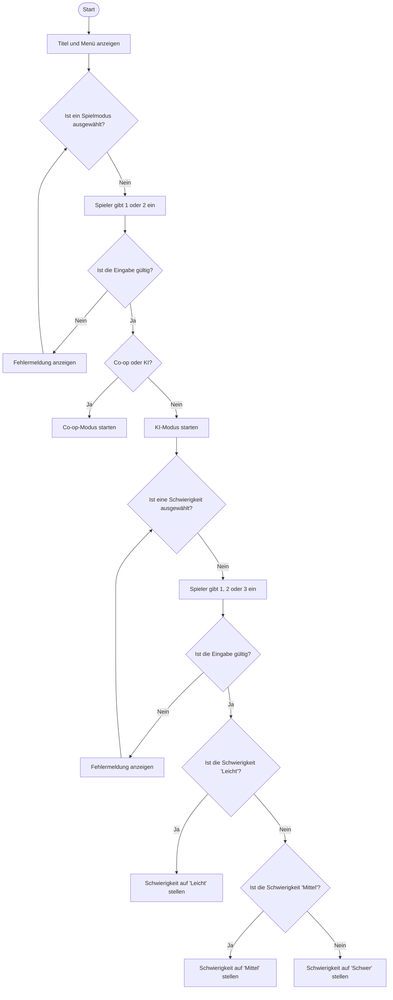

### `main.py` – `main()`
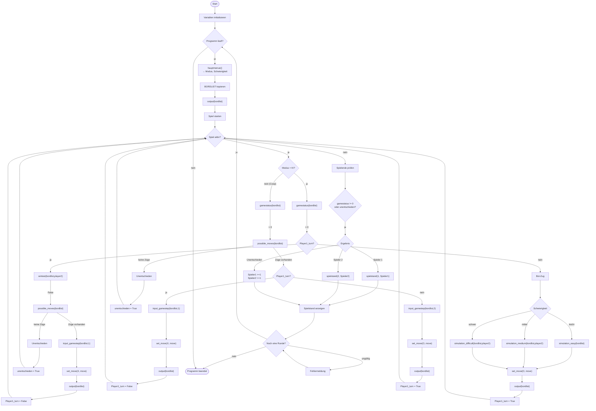

### `logic.py` – `input_gamestep()`
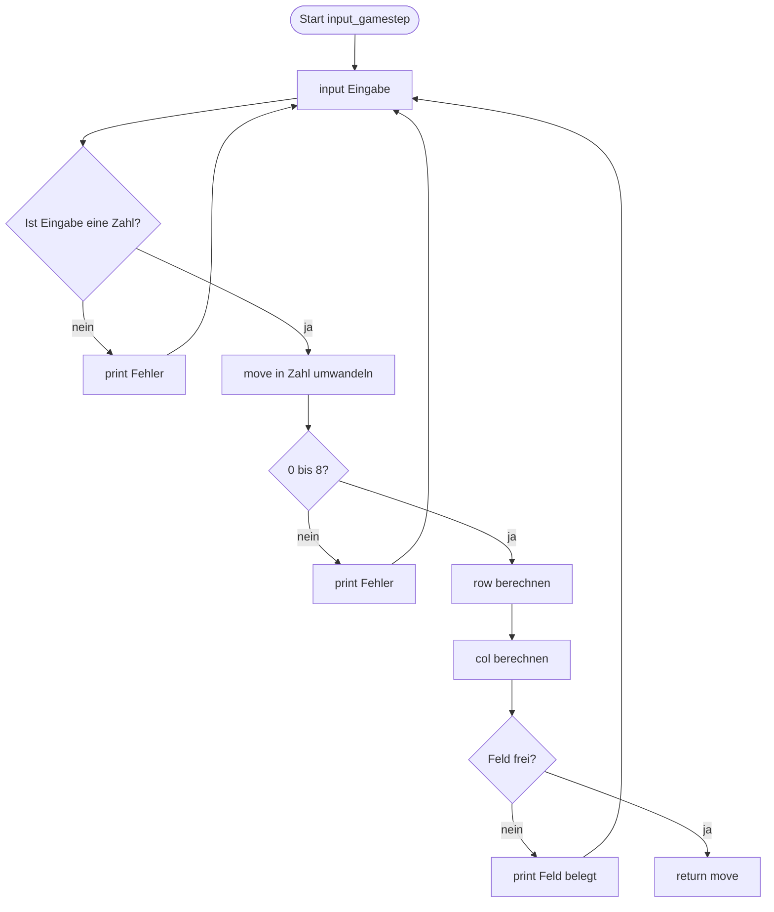

### `logic.py` – `set_move()`
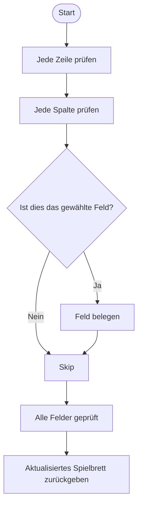

### `logic.py` – `gamestatus()`
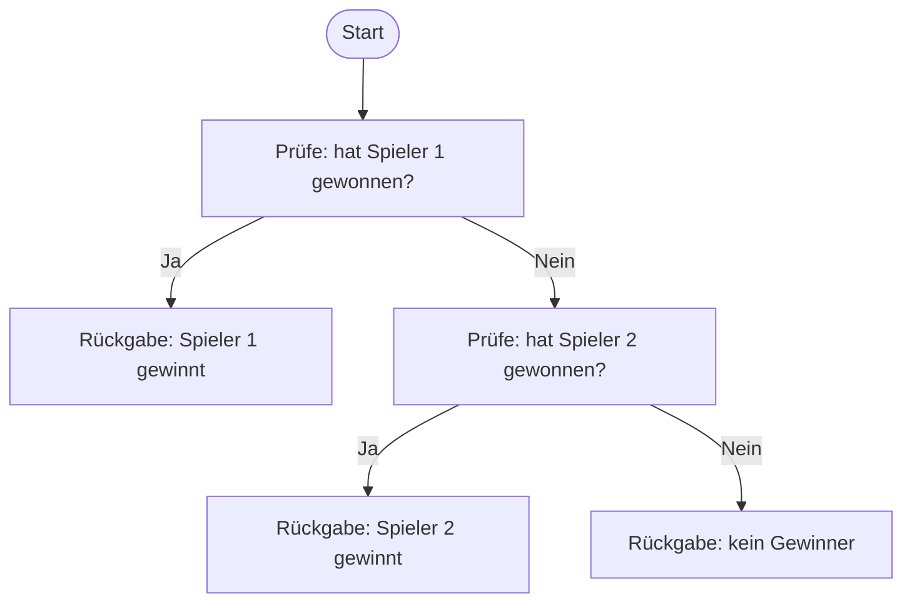

### `logic.py` – `spielstand()`
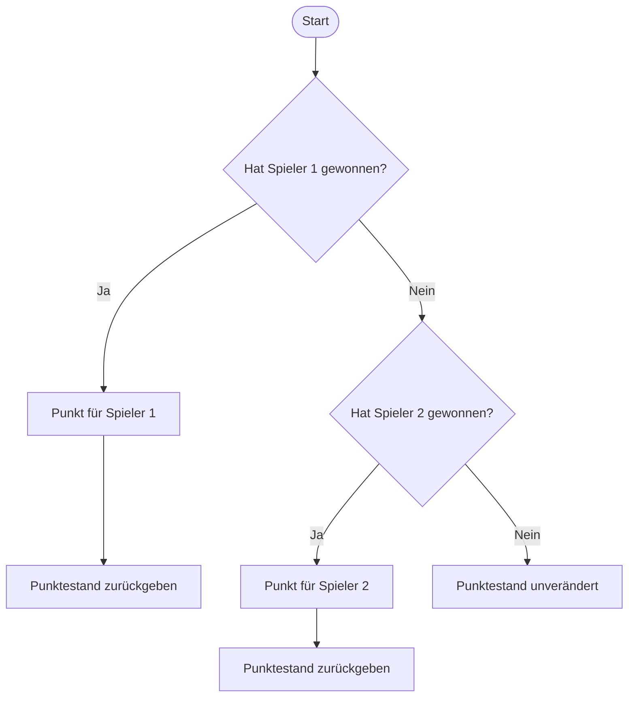

### `logic.py` – `wintest()`
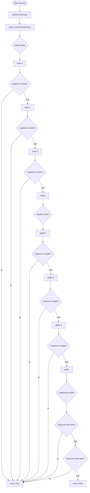

### `logic.py` – `possible_moves()`
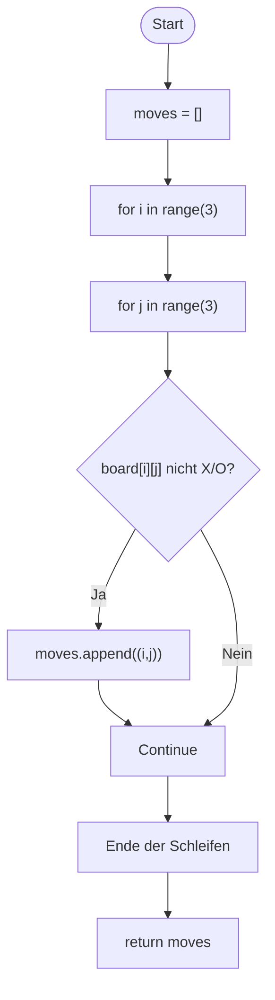

### `logic.py` – `simulation_easy()`
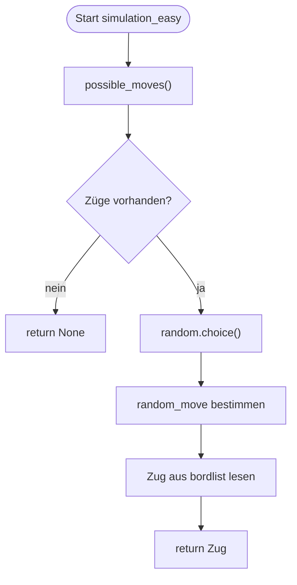

### `logic.py` – `simulation_medium()`
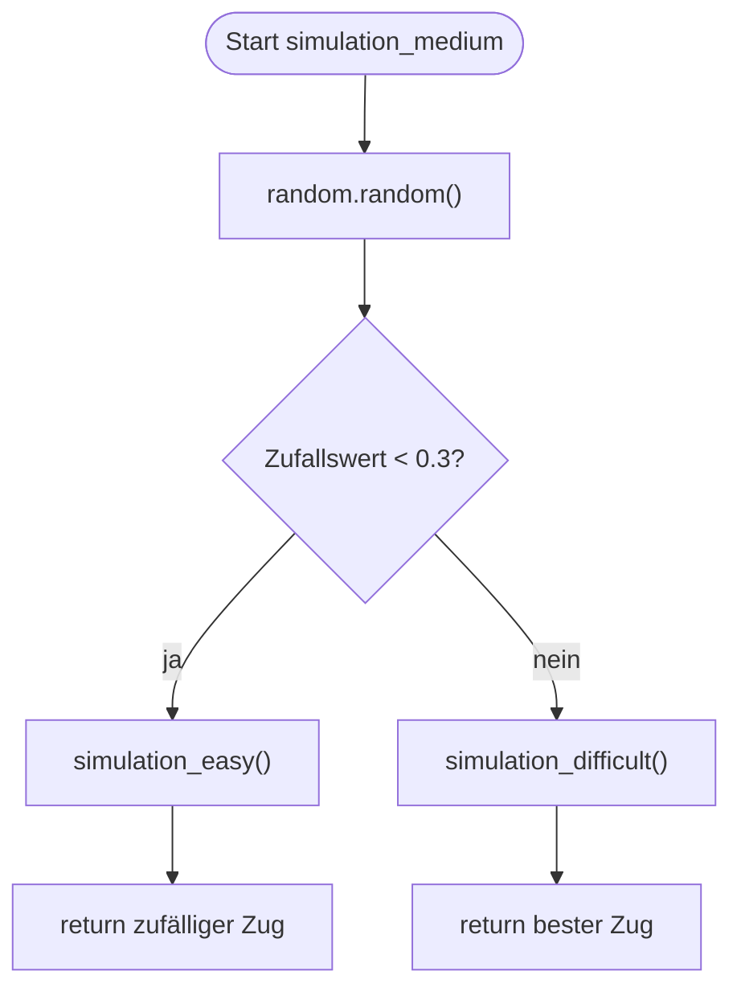

### `logic.py` – `simulation_difficult()`
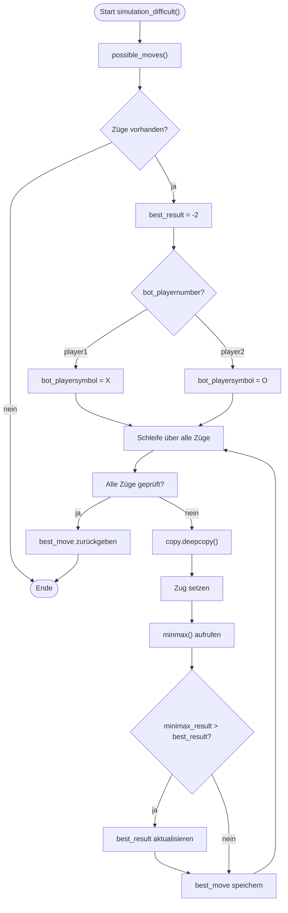

### `logic.py` – `minmax()`
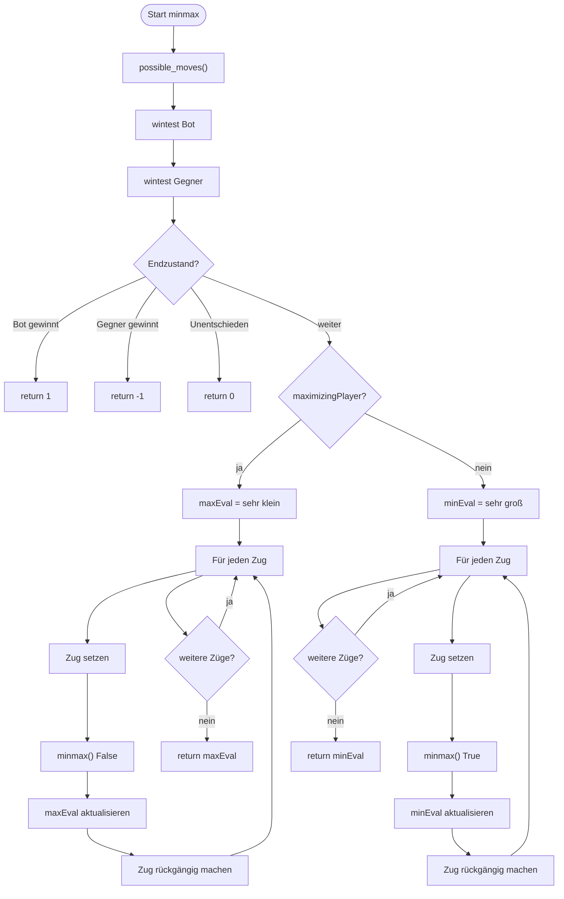

### `logic.py` – `output()`
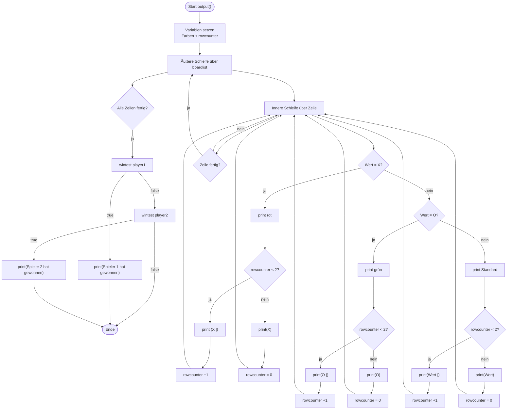