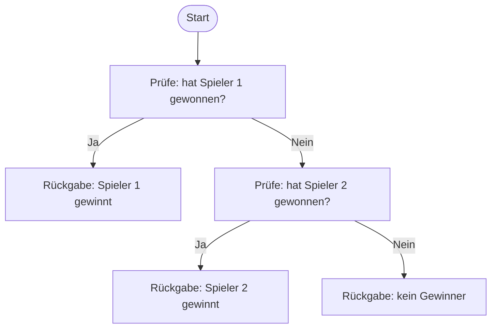

### `logic.py` – `gamestatus()`

```mermaid
flowchart TD
    Start([Start])
    Start --> Win1["Prüfe: hat Spieler 1 gewonnen?"]
    Win1 -- Ja --> Return1["Rückgabe: Spieler 1 gewinnt"]
    Win1 -- Nein --> Win2["Prüfe: hat Spieler 2 gewonnen?"]
    Win2 -- Ja --> Return2["Rückgabe: Spieler 2 gewinnt"]
    Win2 -- Nein --> Return0["Rückgabe: kein Gewinner"]
```