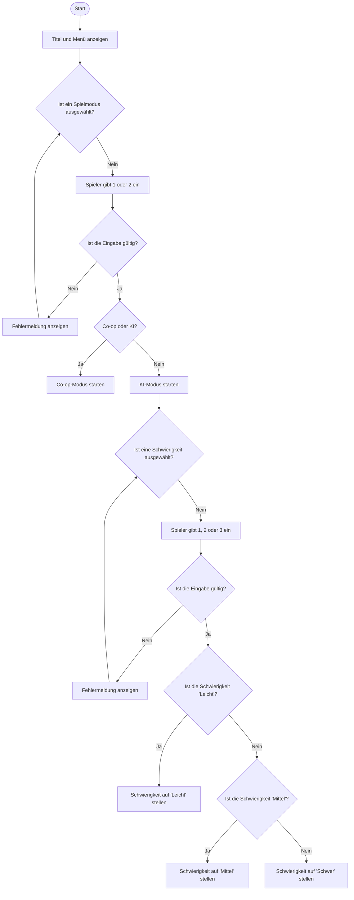

### `menue.py` – `hauptmenue()`

```mermaid
flowchart TD
    Start([Start])
    Start --> PrintTitle["Titel und Menü anzeigen"]

    PrintTitle --> ModeLoop{"Ist ein Spielmodus ausgewählt?"}
    ModeLoop -- Nein --> InputMode["Spieler gibt 1 oder 2 ein"]
    InputMode --> ValidateMode{"Ist die Eingabe gültig?"}
    ValidateMode -- Nein --> PrintInvalid["Fehlermeldung anzeigen"]
    PrintInvalid --> ModeLoop
    ValidateMode -- Ja --> ModeChoice{"Co-op oder KI?"}

    ModeChoice -- Ja --> CoOp["Co-op-Modus starten"]
    ModeChoice -- Nein --> KIStart["KI-Modus starten"]

    KIStart --> DiffLoop{"Ist eine Schwierigkeit ausgewählt?"}
    DiffLoop -- Nein --> InputDiff["Spieler gibt 1, 2 oder 3 ein"]
    InputDiff --> ValidateDiff{"Ist die Eingabe gültig?"}
    ValidateDiff -- Nein --> PrintInvalidDiff["Fehlermeldung anzeigen"]
    PrintInvalidDiff --> DiffLoop
    ValidateDiff -- Ja --> ChooseDiff{"Ist die Schwierigkeit 'Leicht'?"}
    ChooseDiff -- Ja --> Easy["Schwierigkeit auf 'Leicht' stellen"]
    ChooseDiff -- Nein --> ChooseDiff2{"Ist die Schwierigkeit 'Mittel'?"}
    ChooseDiff2 -- Ja --> Medium["Schwierigkeit auf 'Mittel' stellen"]
    ChooseDiff2 -- Nein --> Hard["Schwierigkeit auf 'Schwer' stellen"]
```