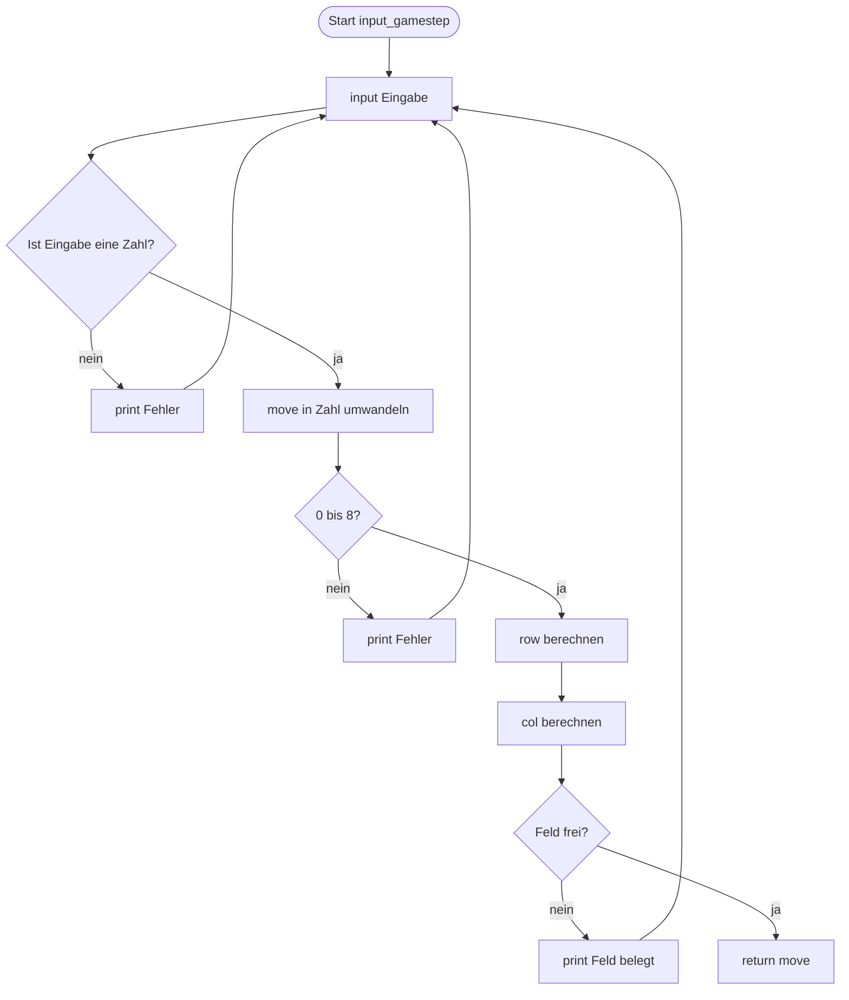

### `logic.py` – `input_gamestep()`

```mermaid
flowchart TD

    A([Start input_gamestep]) --> B[input Eingabe]
    B --> C{Ist Eingabe eine Zahl?}

    C -->|nein| D[print Fehler]
    D --> B

    C -->|ja| E[move in Zahl umwandeln]

    E --> F{0 bis 8?}

    F -->|nein| G[print Fehler]
    G --> B

    F -->|ja| H[row berechnen]
    H --> I[col berechnen]

    I --> J{Feld frei?}

    J -->|nein| K[print Feld belegt]
    K --> B

    J -->|ja| L[return move]
```