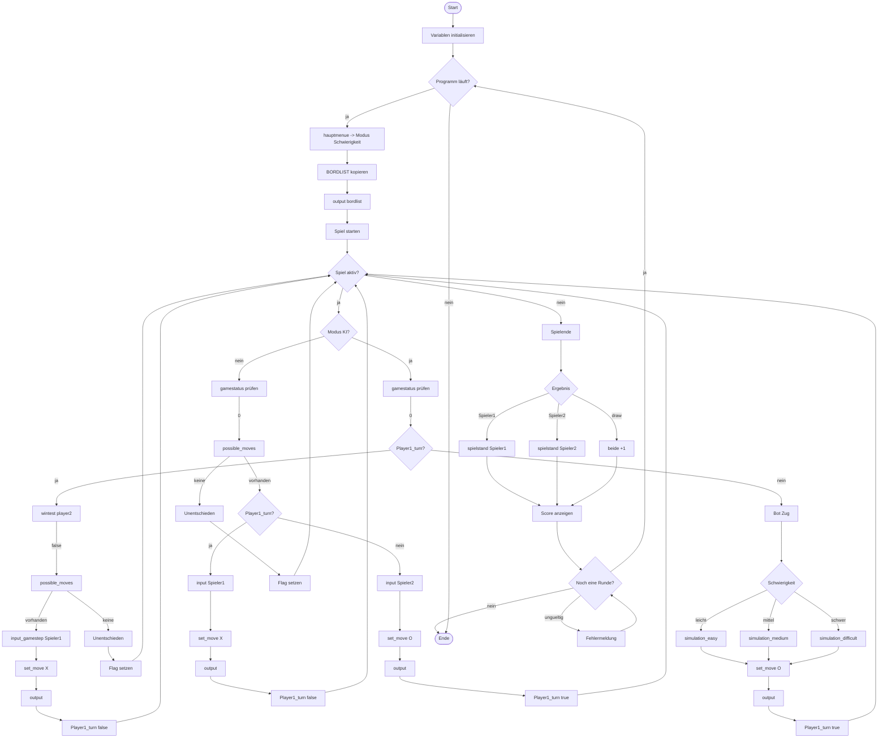
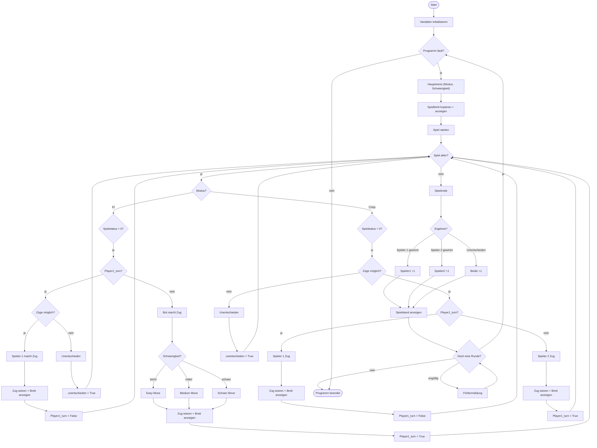
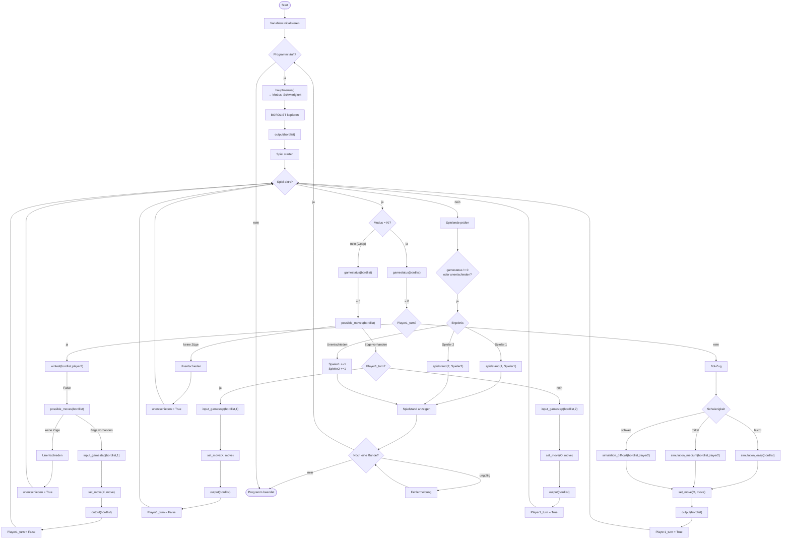

### `main.py` – `main()`

```mermaid
flowchart TD

    A([Start]) --> B[Variablen initialisieren]
    B --> C{Programm läuft?}

    C -->|ja| D[hauptmenue -> Modus Schwierigkeit]
    D --> E[BORDLIST kopieren]
    E --> F[output bordlist]
    F --> G[Spiel starten]

    G --> H{Spiel aktiv?}

    %% ================= KI =================
    H -->|ja| I{Modus KI?}

    I -->|ja| J[gamestatus prüfen]
    J -->|0| K{Player1_turn?}

    K -->|ja| L[wintest player2]
    L -->|false| M[possible_moves]

    M -->|vorhanden| N[input_gamestep Spieler1]
    N --> O[set_move X]
    O --> P[output]
    P --> Q[Player1_turn false]
    Q --> H

    M -->|keine| R[Unentschieden]
    R --> S[Flag setzen]
    S --> H

    K -->|nein| T[Bot Zug]
    T --> U{Schwierigkeit}

    U -->|leicht| V[simulation_easy]
    U -->|mittel| W[simulation_medium]
    U -->|schwer| X[simulation_difficult]

    V --> Y[set_move O]
    W --> Y
    X --> Y

    Y --> Z[output]
    Z --> ZA[Player1_turn true]
    ZA --> H

    %% ================= COOP =================
    I -->|nein| ZB[gamestatus prüfen]
    ZB -->|0| ZC[possible_moves]

    ZC -->|vorhanden| ZD{Player1_turn?}

    ZD -->|ja| ZE[input Spieler1]
    ZE --> ZF[set_move X]
    ZF --> ZG[output]
    ZG --> ZH[Player1_turn false]
    ZH --> H

    ZD -->|nein| ZI[input Spieler2]
    ZI --> ZJ[set_move O]
    ZJ --> ZK[output]
    ZK --> ZL[Player1_turn true]
    ZL --> H

    ZC -->|keine| ZM[Unentschieden]
    ZM --> ZN[Flag setzen]
    ZN --> H

    %% ================= ENDE =================
    H -->|nein| AA[Spielende]

    AA --> AB{Ergebnis}

    AB -->|Spieler1| AC[spielstand Spieler1]
    AB -->|Spieler2| AD[spielstand Spieler2]
    AB -->|draw| AE[beide +1]

    AC --> AF[Score anzeigen]
    AD --> AF
    AE --> AF

    AF --> AG{Noch eine Runde?}

    AG -->|ja| C
    AG -->|nein| AH([Ende])

    AG -->|ungueltig| AI[Fehlermeldung]
    AI --> AG

    C -->|nein| AH
```

```mermaid
flowchart TD


    A([Start]) --> B[Variablen initialisieren]

    B --> C{Programm läuft?}

    C -->|ja| D["Hauptmenü (Modus, Schwierigkeit)"]
    D --> E[Spielbrett kopieren + anzeigen]
    E --> F[Spiel starten]

    F --> G{Spiel aktiv?}

    %% ================= KI MODUS =================
    G -->|ja| H{Modus?}

    H -->|KI| I{Spielstatus = 0?}

    I -->|ja| J{Player1_turn?}

    J -->|ja| K{Züge möglich?}

    K -->|ja| L[Spieler 1 macht Zug]
    L --> M[Zug setzen + Brett anzeigen]
    M --> N[Player1_turn = False]
    N --> G

    K -->|nein| O[Unentschieden]
    O --> P[unentschieden = True]
    P --> G

    J -->|nein| Q[Bot macht Zug]
    Q --> R{Schwierigkeit?}

    R -->|leicht| S[Easy Move]
    R -->|mittel| T[Medium Move]
    R -->|schwer| U[Schwer Move]

    S --> V[Zug setzen + Brett anzeigen]
    T --> V
    U --> V

    V --> W[Player1_turn = True]
    W --> G

    %% ================= COOP MODUS =================
    H -->|Coop| X{Spielstatus = 0?}

    X -->|ja| Y{Züge möglich?}

    Y -->|ja| Z{Player1_turn?}

    Z -->|ja| ZA[Spieler 1 Zug]
    ZA --> ZB[Zug setzen + Brett anzeigen]
    ZB --> ZC[Player1_turn = False]
    ZC --> G

    Z -->|nein| ZD[Spieler 2 Zug]
    ZD --> ZE[Zug setzen + Brett anzeigen]
    ZE --> ZF[Player1_turn = True]
    ZF --> G

    Y -->|nein| ZG[Unentschieden]
    ZG --> ZH[unentschieden = True]
    ZH --> G

    %% ================= SPIELENDE =================
    G -->|nein| AA[Spielende]

    AA --> AB{Ergebnis?}

    AB -->|Spieler 1 gewinnt| AC[Spieler1 +1]
    AB -->|Spieler 2 gewinnt| AD[Spieler2 +1]
    AB -->|Unentschieden| AE[Beide +1]

    AC --> AF[Spielstand anzeigen]
    AD --> AF
    AE --> AF

    AF --> AG{Noch eine Runde?}

    AG -->|ja| C
    AG -->|nein| AH([Programm beendet])

    %% Ungültige Eingabe
    AG -->|ungültig| AI[Fehlermeldung]
    AI --> AG

    %% Direkter Abbruch
    C -->|nein| AH
```

ich glaub am bessten

```mermaid
    flowchart TD

    A([Start]) --> B[Variablen initialisieren]

    B --> C{Programm läuft?}

    C -->|ja| D["hauptmenue()"<br/>→ Modus, Schwierigkeit]
    D --> E[BORDLIST kopieren]
    E --> F["output(bordlist)"]
    F --> G[Spiel starten]

    G --> H{Spiel aktiv?}

    %% ================= KI MODUS =================
    H -->|ja| I{Modus = KI?}

    I -->|ja| J["gamestatus(bordlist)"]
    J -->|= 0| K{Player1_turn?}

    K -->|ja| L["wintest(bordlist,player2)"]

    L -->|False| M["possible_moves(bordlist)"]

    M -->|Züge vorhanden| N["input_gamestep(bordlist,1)"]
    N --> O["set_move(X, move)"]
    O --> P["output(bordlist)"]
    P --> Q[Player1_turn = False]
    Q --> H

    M -->|keine Züge| R[Unentschieden]
    R --> S[unentschieden = True]
    S --> H

    K -->|nein| T[Bot-Zug]
    T --> U{Schwierigkeit}

    U -->|leicht| V["simulation_easy(bordlist)"]
    U -->|mittel| W["simulation_medium(bordlist,player2)"]
    U -->|schwer| X["simulation_difficult(bordlist,player2)"]

    V --> Y["set_move(O, move)"]
    W --> Y
    X --> Y

    Y --> Z["output(bordlist)"]
    Z --> ZA[Player1_turn = True]
    ZA --> H

    %% ================= COOP MODUS =================
    I -->|"nein (Coop)"| ZB["gamestatus(bordlist)"]

    ZB -->|= 0| ZC["possible_moves(bordlist)"]

    ZC -->|Züge vorhanden| ZD{Player1_turn?}

    ZD -->|ja| ZE["input_gamestep(bordlist,1)"]
    ZE --> ZF["set_move(X, move)"]
    ZF --> ZG["output(bordlist)"]
    ZG --> ZH[Player1_turn = False]
    ZH --> H

    ZD -->|nein| ZI["input_gamestep(bordlist,2)"]
    ZI --> ZJ["set_move(O, move)"]
    ZJ --> ZK["output(bordlist)"]
    ZK --> ZL[Player1_turn = True]
    ZL --> H

    ZC -->|keine Züge| ZM[Unentschieden]
    ZM --> ZN[unentschieden = True]
    ZN --> H

    %% ================= SPIELENDE =================
    H -->|nein| AA[Spielende prüfen]

    AA --> AB{gamestatus != 0<br/>oder unentschieden?}

    AB -->|ja| AC{Ergebnis}

    AC -->|Spieler 1| AD["spielstand(1, Spieler1)"]
    AC -->|Spieler 2| AE["spielstand(2, Spieler2)"]
    AC -->|Unentschieden| AF[Spieler1 +=1<br/>Spieler2 +=1]

    AD --> AG[Spielstand anzeigen]
    AE --> AG
    AF --> AG

    AG --> AH{Noch eine Runde?}

    AH -->|ja| C
    AH -->|nein| AI([Programm beendet])

    AH -->|ungültig| AJ[Fehlermeldung]
    AJ --> AH

    %% Direkter Abbruch
    C -->|nein| AI
```