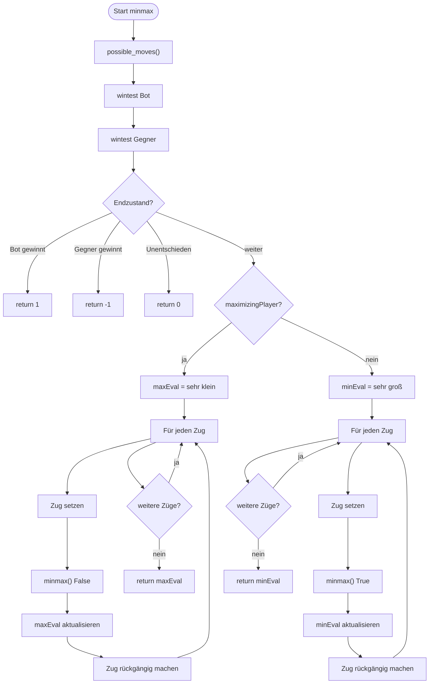

### `logic.py` – `minmax()`

```mermaid
flowchart TD

    A([Start minmax]) --> B["possible_moves()"]
    B --> C[wintest Bot]
    C --> D[wintest Gegner]

    D --> E{Endzustand?}

    E -->|Bot gewinnt| F[return 1]
    E -->|Gegner gewinnt| G[return -1]
    E -->|Unentschieden| H[return 0]

    E -->|weiter| I{maximizingPlayer?}

    %% ================= MAX =================
    I -->|ja| J[maxEval = sehr klein]

    J --> K[Für jeden Zug]

    K --> L[Zug setzen]
    L --> M["minmax() False"]
    M --> N[maxEval aktualisieren]
    N --> O[Zug rückgängig machen]

    O --> K

    K --> P{weitere Züge?}
    P -->|ja| K
    P -->|nein| Q[return maxEval]

    %% ================= MIN =================
    I -->|nein| R[minEval = sehr groß]

    R --> S[Für jeden Zug]

    S --> T[Zug setzen]
    T --> U["minmax() True"]
    U --> V[minEval aktualisieren]
    V --> W[Zug rückgängig machen]

    W --> S

    S --> X{weitere Züge?}
    X -->|ja| S
    X -->|nein| Y[return minEval]
```