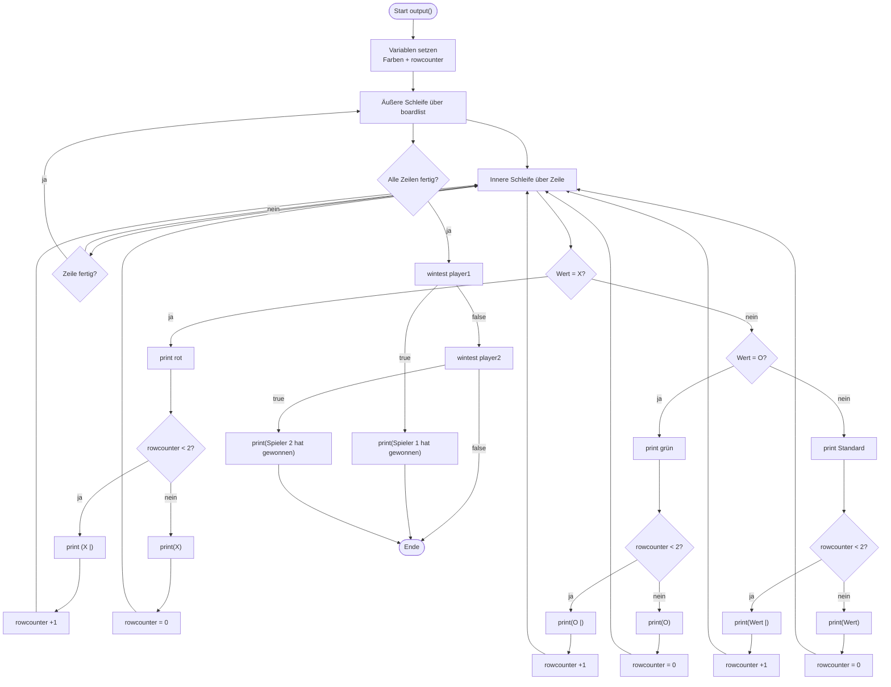

### `logic.py` – `output()`

mit print statements:

```mermaid
flowchart TD

    A(["Start output()"]) --> B[Variablen setzen<br/>Farben + rowcounter]

    B --> C[Äußere Schleife über boardlist]

    C --> D[Innere Schleife über Zeile]

    D --> E{Wert = X?}

    E -->|ja| F[print rot]
    F --> G{rowcounter < 2?}

    G -->|ja| H["print (X |)"]
    H --> I[rowcounter +1]

    G -->|nein| J["print(X)"]
    J --> K[rowcounter = 0]

    E -->|nein| L{Wert = O?}

    L -->|ja| M[print grün]
    M --> N{rowcounter < 2?}

    N -->|ja| O["print(O |)"]
    O --> P[rowcounter +1]

    N -->|nein| Q["print(O)"]
    Q --> R[rowcounter = 0]

    L -->|nein| S[print Standard]
    S --> T{rowcounter < 2?}

    T -->|ja| U["print(Wert |)"]
    U --> V[rowcounter +1]

    T -->|nein| W["print(Wert)"]
    W --> X[rowcounter = 0]

    I --> D
    K --> D
    P --> D
    R --> D
    V --> D
    X --> D

    D --> Y{Zeile fertig?}
    Y -->|nein| D
    Y -->|ja| C

    C --> Z{Alle Zeilen fertig?}

    Z -->|ja| AA[wintest player1]

    AA -->|true| AB["print(Spieler 1 hat gewonnen)"]

    AA -->|false| AC[wintest player2]

    AC -->|true| AD["print(Spieler 2 hat gewonnen)"]

    AC -->|false| AE([Ende])

    AB --> AE
    AD --> AE
```