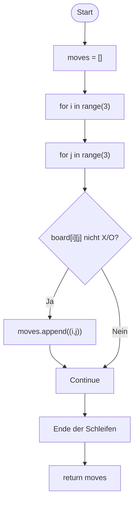

### `logic.py` – `possible_moves()`

```mermaid
flowchart TD
    Start([Start])
    Start --> Init["moves = []"]
    Init --> ForI["for i in range(3)"]
    ForI --> ForJ["for j in range(3)"]
    ForJ --> Check{"board[i][j] nicht X/O?"}
    Check -- Ja --> Add["moves.append((i,j))"]
    Add --> Continue
    Check -- Nein --> Continue
    Continue --> EndLoops["Ende der Schleifen"]
    EndLoops --> Return["return moves"]
```