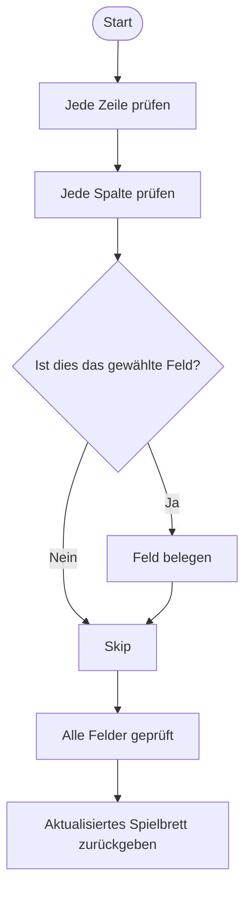

### `logic.py` – `set_move()`

```mermaid
flowchart TD
    Start([Start])
    Start --> ForRow["Jede Zeile prüfen"]
    ForRow --> ForCol["Jede Spalte prüfen"]
    ForCol --> Match{"Ist dies das gewählte Feld?"}
    Match -- Ja --> Set["Feld belegen"]
    Match -- Nein --> Skip
    Set --> Skip
    Skip --> LoopEnd["Alle Felder geprüft"]
    LoopEnd --> Return["Aktualisiertes Spielbrett zurückgeben"]
```