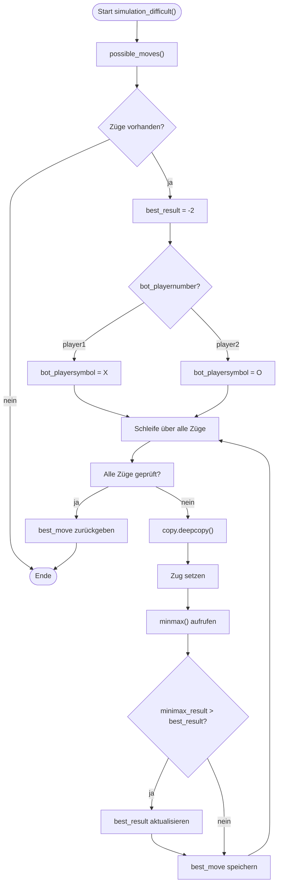

### `logic.py` – `simulation_difficult()`

```mermaid
flowchart TD

    A(["Start simulation_difficult()"]) --> B["possible_moves()"]
    B --> C{Züge vorhanden?}

    C -->|ja| D[best_result = -2]
    C -->|nein| Z([Ende])

    D --> E{bot_playernumber?}

    E -->|player1| F[bot_playersymbol = X]
    E -->|player2| G[bot_playersymbol = O]

    F --> H[Schleife über alle Züge]
    G --> H

    
    I --> J[Zug setzen]

    J --> K["minmax() aufrufen"]

    K --> L{minimax_result > best_result?}

    L -->|ja| M[best_result aktualisieren]
    M --> N[best_move speichern]
    L -->|nein| N

    N --> H

    H --> O[Alle Züge geprüft?]
    O -->|nein| I["copy.deepcopy()"]
    O -->|ja| P[best_move zurückgeben]

    P --> Z([Ende])
```