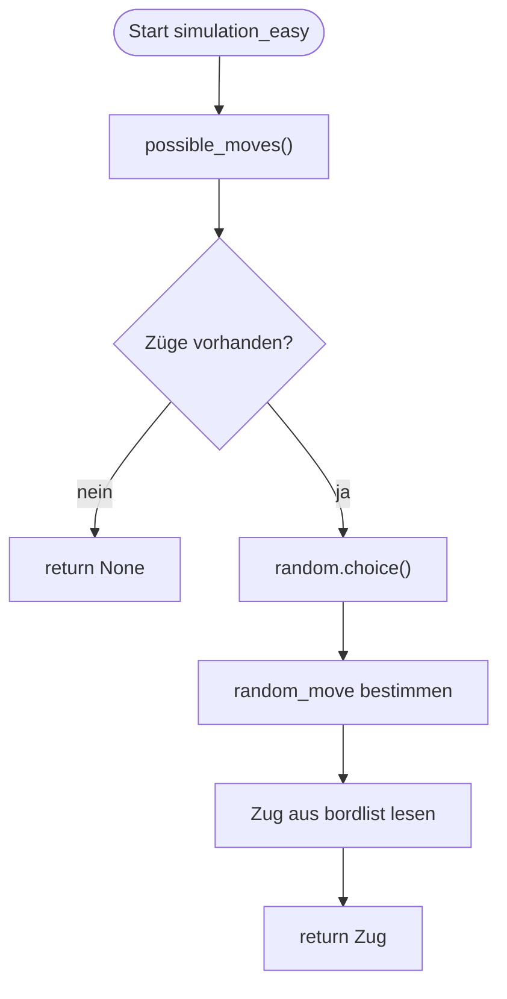

### `logic.py` – `simulation_easy()`

```mermaid
flowchart TD

    A([Start simulation_easy]) --> B["possible_moves()"]

    B --> C{Züge vorhanden?}

    C -->|nein| D[return None]

    C -->|ja| E["random.choice()"]
    E --> F[random_move bestimmen]

    F --> G[Zug aus bordlist lesen]

    G --> H[return Zug]
```