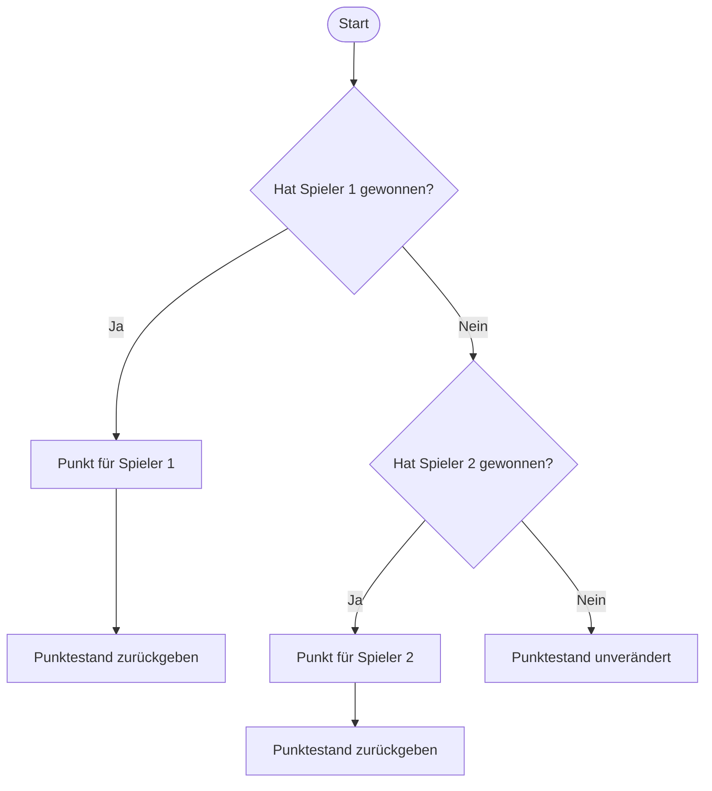

### `logic.py` – `spielstand()`

```mermaid
flowchart TD
    Start([Start])
    Start --> Check1{"Hat Spieler 1 gewonnen?"}
    Check1 -- Ja --> Inc1["Punkt für Spieler 1"]
    Inc1 --> Return1["Punktestand zurückgeben"]
    Check1 -- Nein --> Check2{"Hat Spieler 2 gewonnen?"}
    Check2 -- Ja --> Inc2["Punkt für Spieler 2"]
    Inc2 --> Return2["Punktestand zurückgeben"]
    Check2 -- Nein --> ReturnNone["Punktestand unverändert"]
```