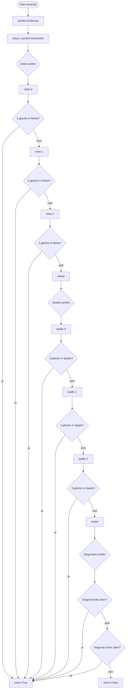

### `logic.py` – `wintest()`

```mermaid
flowchart TD


    A(["Start wintest()"]) --> B[symbol Dictionary]
    B --> C[player_symbol bestimmen]

    C --> D{Zeilen prüfen}

    D --> E[reihe 0]
    E --> F{3 gleiche in Reihe?}
    F -->|ja| G[return True]

    F -->|nein| H[reihe 1]
    H --> I{3 gleiche in Reihe?}
    I -->|ja| G
    I -->|nein| J[reihe 2]
    J --> K{3 gleiche in Reihe?}
    K -->|ja| G
    K -->|nein| L[weiter]

    L --> M{Spalten prüfen}

    M --> N[spalte 0]
    N --> O{3 gleiche in Spalte?}
    O -->|ja| G
    O -->|nein| P[spalte 1]
    P --> Q{3 gleiche in Spalte?}
    Q -->|ja| G
    Q -->|nein| R[spalte 2]
    R --> S{3 gleiche in Spalte?}
    S -->|ja| G
    S -->|nein| T[weiter]

    T --> U{Diagonalen prüfen}

    U --> V{Diagonal links oben?}
    V -->|ja| G

    V -->|nein| W{Diagonal rechts oben?}
    W -->|ja| G

    W -->|nein| X[return False]
```